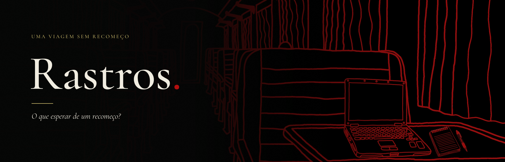
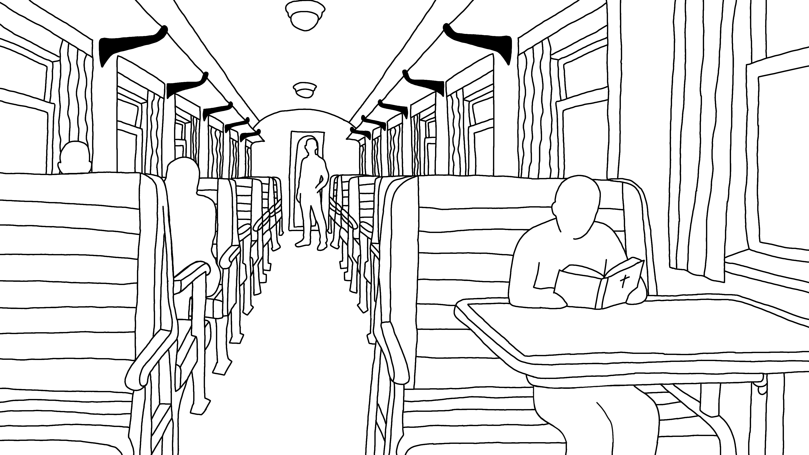
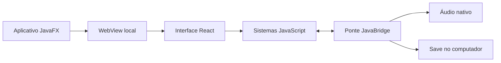

<p align="center"></p>

<p align="center"><strong>O que esperar de um recomeço?</strong></p>
<p align="center">Investigação · Terror psicológico · Uma experiência narrativa para Windows</p>
<p align="center"><a href="https://atlasaqui.itch.io/rastros"><strong>Baixar e jogar no itch.io</strong></a> · <a href="#como-executar-o-código">Executar o código</a> · <a href="docs/ARQUITETURA.md">Arquitetura</a></p>

## A viagem

**Rastros** acompanha Murilo em uma viagem de trem atravessada por conversas inquietantes, documentos e lembranças. Investigar é observar: examinar os vagões, ouvir passageiros e consultar registros que ajudam a compreender o que aconteceu.

O notebook dá acesso ao **Iwakura OS**, um ambiente inspirado nos computadores dos anos 2000. Nele, históricos de mensagens e documentos se tornam pistas. Conforme a narrativa avança, a aparência dos cenários muda, colocando em dúvida a percepção do protagonista.

O projeto foi desenvolvido para o **Jogo Coletivo**, uma game jam literária, com inspiração em **O Perseguido, de Osman Lins**. A investigação, a perseguição e a instabilidade da percepção orientam a experiência do jogo. A autoria foi informada pela equipe; a edição utilizada não foi especificada.

> Conteúdo: violência, morte, sangue, intolerância religiosa e efeitos de glitch com flashes.

### Explore o projeto

[Experiência](#como-o-jogo-funciona) · [Controles](#controles) · [Download](#jogar-no-windows) · [Tecnologias](#como-foi-feito) · [Desenvolvimento](#como-executar-o-código) · [Equipe](#equipe)

## Como o jogo funciona

| Interação | Papel na investigação |
|---|---|
| **Explorar** | Passar o mouse e clicar em passageiros, objetos e portas para encontrar informações. |
| **Conversar** | Acompanhar diálogos e pensamentos de Murilo. |
| **Investigar o computador** | Consultar arquivos e históricos no Iwakura OS e resolver condições de acesso. |
| **Anotar** | Recolher o caderno, consultar objetivos indiretos e acompanhar tarefas concluídas. |
| **Resolver** | Relacionar pistas aos puzzles para avançar. |

As conversas do MSN são **registros arquivados**: as mensagens já foram enviadas e o jogador apenas lê o histórico. Não é necessário responder aos contatos.

O caderno reúne anotações, objetivos e tarefas concluídas. Após examinar o piano e rever a conversa com a partitura, suas notas são registradas e um papel de consulta aparece junto ao instrumento.

A experiência inclui uma perseguição em pixel art por cinco vagões. Esses vagões pertencem ao minigame e não devem ser confundidos com a organização dos cenários narrativos. Os bancos bloqueiam o jogador; as mãos ameaçadoras podem atravessá-los.

O piano é tocado **com o mouse, uma tecla de cada vez**, sem acordes obrigatórios ou limite de tempo entre notas. Durante a tentativa, apenas as teclas soam. A progressão depende da sequência completa, sem indicador de acertos parciais.

### Arte e atmosfera

<p align="center"></p>
<p align="center"><em>Arte original do cenário: traços desenhados e espaço para observar.</em></p>

A paleta acompanha a percepção de Murilo: do cenário claro às variações em preto e branco e, depois, preto e vermelho. A interface investigativa usa painéis escuros, texto claro e detalhes amarelos. O computador preserva uma identidade própria, inspirada na época dos seus registros.

## Controles

| Controle | Ação |
|---|---|
| Mouse | Explorar, conversar, examinar e usar o computador |
| Clique nas teclas do piano | Tocar uma nota por clique |
| WASD ou setas | Mover Murilo no minigame em pixel art |
| Esc | Pausar ou voltar, conforme a interação aberta |
| F11 | Alternar tela cheia no aplicativo Windows |
| E | Aproximar-se do notebook quando disponível |

## Jogar no Windows

**[Baixe Rastros no itch.io](https://atlasaqui.itch.io/rastros).**

1. Baixe o pacote Windows.
2. Extraia **todo** o ZIP para uma pasta.
3. Abra **Rastros.exe**.
4. Mantenha as pastas `app` e `runtime` junto do executável.

O pacote inclui o ambiente de execução. Não é necessário instalar Java ou Node, iniciar um servidor ou abrir um navegador. Não execute diretamente de dentro do ZIP.

O progresso é salvo automaticamente em `%LOCALAPPDATA%\Rastros\save`. Use **Continuar viagem** para retomar. Ao atualizar, extraia o novo pacote em uma pasta separada; não apague o save.

## Como foi feito

Rastros combina uma aplicação desktop em **JavaFX** com uma interface construída em **React**. React é uma biblioteca de JavaScript: cada tecnologia assume uma responsabilidade na mesma aplicação.

| Tecnologia | Responsabilidade |
|---|---|
| **Java / JavaFX** | Janela desktop, WebView, acesso ao armazenamento, reprodução nativa de áudio e integração com o Windows |
| **JavaScript** | Regras, flags, progressão narrativa, puzzles, entrada do jogador e comunicação com o Java |
| **React** | Componentes de cenários, diálogos, Iwakura OS, caderno, puzzles e cenas |
| **CSS** | Layout, identidade visual, responsividade e animações |
| **Canvas 2D** | Renderização do minigame e recortes gráficos específicos |
| **Maven / esbuild / jpackage** | Dependências Java, compilação da interface e pacote desktop |



A WebView carrega os arquivos compilados da interface **localmente**. A ponte `window.bridge` permite que JavaScript solicite ao Java operações como salvar progresso e tocar áudio. O código da interface pode ser desenvolvido com ferramentas web, mas a distribuição do jogo é um aplicativo desktop.

Versões declaradas: React 18.3.1, JavaFX 21.0.2, Gson 2.11.0 e esbuild 0.21.5. O frontend também inclui Framer Motion e scripts alternativos com Vite.

### Processo de construção

1. **Roteiro e dados:** cenas, diálogos, documentos e objetivos foram organizados em dados separados dos componentes.
2. **Exploração:** os cenários receberam áreas clicáveis proporcionais à imagem, mantendo a posição das interações em diferentes resoluções.
3. **Interface:** React compõe o ambiente e suas sobreposições; CSS define a apresentação visual.
4. **Investigação:** o computador reúne aplicativos, registros e condições de desbloqueio, conectados à narrativa por flags.
5. **Progressão:** os sistemas atualizam as condições da história, objetivos e variações visuais sem reiniciar a partida ao trocar de contexto.
6. **Minigames:** o Canvas desenha a perseguição; a simulação controla movimento, colisões, mãos e transições. O piano relaciona cada tecla ao áudio e à sequência esperada.
7. **Persistência:** o estado é normalizado e migrado no JavaScript e gravado pela camada Java no aplicativo.
8. **Validação e distribuição:** testes de regras e testes na WebView acompanham builds e correções; `jpackage` cria o pacote com runtime incluído.

A implementação evoluiu sobre a base existente enviada pela equipe, preservando funcionalidades e incorporando ajustes sucessivos de narrativa, interface, áudio e interação. A descrição acima apresenta a organização atual, não uma cronologia exata de todos os commits.

## Como executar o código

### Pré-requisitos de desenvolvimento

- **JDK 21 completo** recomendado, com `java`, `jar`, `jlink` e `jpackage` no PATH. O projeto declara nível de compilação Java 17 e usa JavaFX 21.0.2.
- **Maven**.
- **Node.js e npm**; a validação local utiliza Node 22.
- Windows para o empacotador incluído.

```powershell
cd frontend
npm ci
npm run build
npm test
cd ..
mvn compile
mvn javafx:run
```

O build da interface deve acontecer **antes** de iniciar o JavaFX: gera `src/main/resources/web`, que não é versionado por conter cópias de arquivos de distribuição.

Para trabalhar só na interface:

```powershell
cd frontend
npm run dev
```

O servidor local é uma ferramenta de desenvolvimento. Ele não é necessário para o jogador. O script principal usa **esbuild** para gerar a interface portátil; scripts alternativos com Vite também estão declarados no frontend.

### Gerar o pacote Windows

Na raiz do projeto, com as dependências Maven já baixadas:

```powershell
powershell -ExecutionPolicy Bypass -File tools/package-windows.ps1 -OutputDirectory dist/windows
```

Escolha uma pasta de saída nova. O script compila a interface, compila Java em modo offline, cria um runtime com `jlink` e empacota com `jpackage`. Para outro JDK, informe `-JdkRoot`.

### Testes e limites da validação

```powershell
cd frontend
npm test
```

Há testes para progressão, save, puzzles, colisões e dados compartilhados. Testes de integração na WebView estão em `frontend/tests/*smoke.js` e exigem um cenário de teste apropriado; alguns scripts manipulam partidas de teste e podem conter spoilers.

Na preparação desta publicação, **70 testes passaram**, a interface foi compilada e o Maven compilou os nove arquivos Java. Isso não substitui testes manuais em outras máquinas, de desempenho ou de acessibilidade. Os relatórios históricos em `docs/` registram verificações de versões específicas.

## Estrutura e extensão

```text
frontend/
  src/components/   telas e interações em React
  src/data/         cenas, diálogos, arquivos, flags e assets
  src/systems/      regras e progressão
  src/save/         estado, normalização e migrações
  src/styles/       apresentação visual
  public/media/     arte e derivados usados em execução
  tests/            testes das regras e da WebView
src/main/java/      aplicativo JavaFX e ponte nativa
src/main/resources/audio/  áudio do jogo
tools/              empacotamento e preparação de recursos
docs/               documentação técnica e relatórios
```

Veja **[Arquitetura e guia de extensão](docs/ARQUITETURA.md)** para localizar dados e acrescentar cenários, personagens, conversas ou puzzles.

## Equipe

| Área | Integrante |
|---|---|
| Narrativa | Amanda Queiroz |
| Arte 2D | Luana Meneghini |
| Game Design e Sound Design | Matheus Medeiros |
| Programação e UX Design | Victor Monteiro |

Os nomes e as funções acima correspondem aos créditos implementados no jogo.

## Arte, referências e uso do material

Este repositório documenta e apresenta o projeto da equipe. Nenhuma licença aberta foi atribuída automaticamente. A disponibilidade do código não concede, por si só, autorização de reutilização de músicas, imagens ou outros materiais. Consulte a equipe sobre permissões específicas.

[Banner editável no Figma](https://www.figma.com/design/Wy7LbO80oPOOCSrPDYTBlD?node-id=1-2) · [Página do jogo no itch.io](https://atlasaqui.itch.io/rastros)
